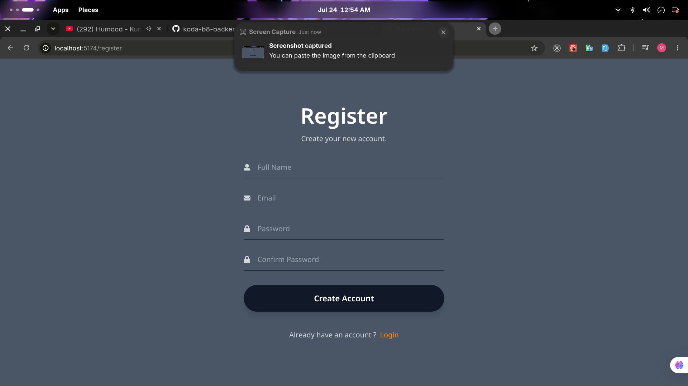
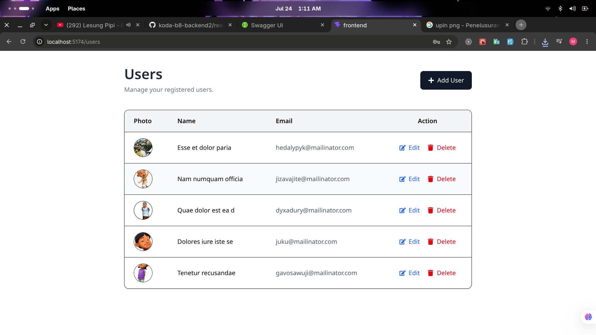
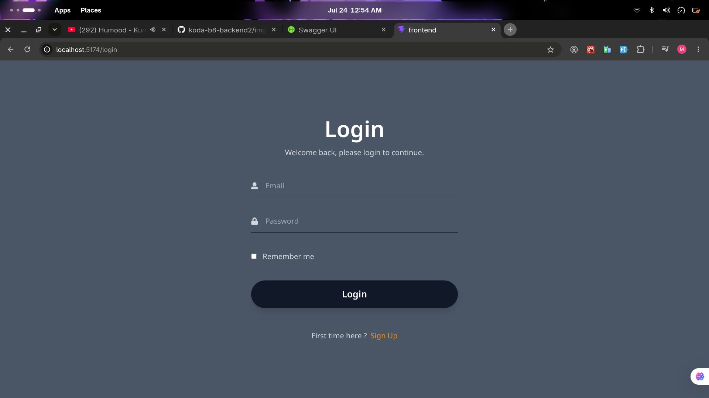
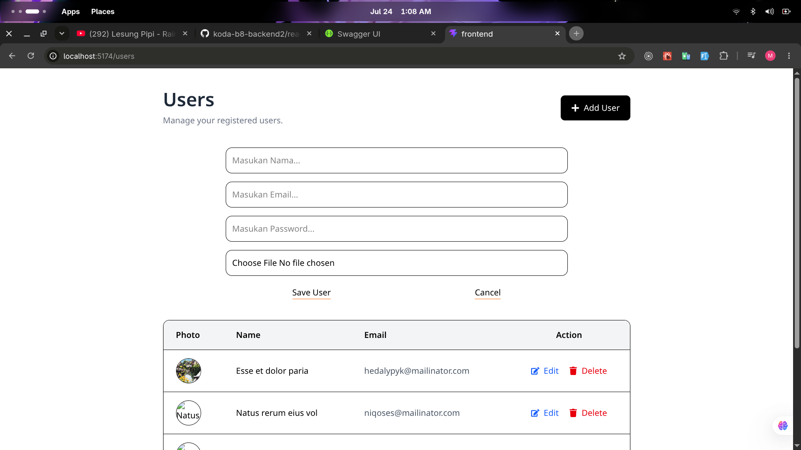
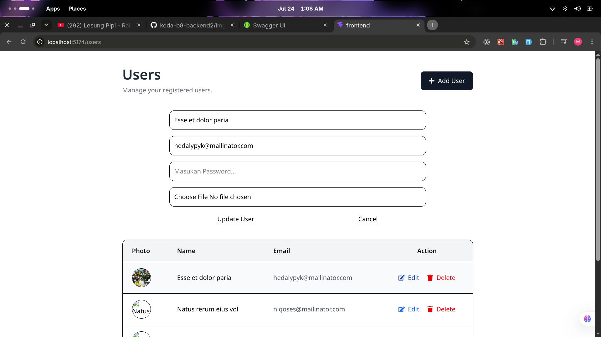
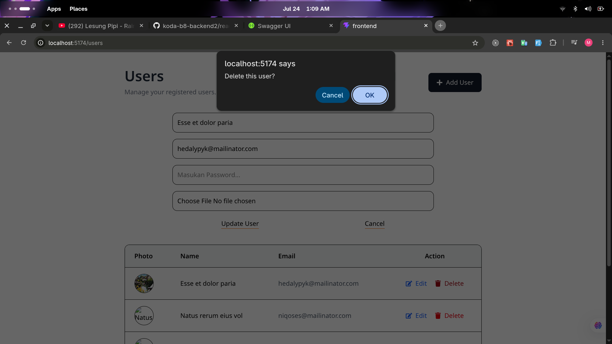

# Backend CRUD API

Backend CRUD API merupakan REST API sederhana yang dibuat menggunakan Golang dan Gin Framework. Project ini menyediakan fitur autentikasi menggunakan JWT, CRUD User, upload gambar, serta dokumentasi API menggunakan Swagger.

---

## Tech Stack

- Golang
- Gin Framework
- PostgreSQL
- PGX
- JWT Authentication
- Swagger
- Air

---

## Features

- Register
- Login
- JWT Authentication
- Create User
- Get All Users
- Get User By ID
- Update User
- Delete User
- Upload Image
- Search User
- Pagination
- Sorting
- Swagger Documentation
- Password Hashing (bcrypt)

---

## Project Structure

```
.
├── cmd
│   └── main.go
├── docs
├── frontend
├── internal
│   ├── di
│   ├── handler
│   ├── lib
│   ├── middleware
│   ├── model
│   ├── repo
│   └── svc
├── migrations
├── uploads
├── request.http
├── go.mod
└── go.sum
```

---

## Installation

Clone repository

```bash
git clone https://github.com/muhammadwahyupratamaa/koda-b8-backend2.git
```

Masuk ke folder project

```bash
cd koda-b8-backend2
```

Install dependency

```bash
go mod tidy
```

Buat file `.env`

```env
DB_HOST=localhost
DB_PORT=5432
DB_USER=postgres
DB_PASSWORD=your_password
DB_NAME=authentication

JWT_SECRET=your_secret_key
```

Jalankan database migration

```bash
migrate -path migrations -database "<DATABASE_URL>" up
```

Jalankan project

Menggunakan Air

```bash
air
```

atau

```bash
go run cmd/main.go
```

---

## API Documentation

Swagger dapat diakses melalui

```
http://localhost:8080/docs/index.html
```

---

## API Endpoints

### Authentication

| Method | Endpoint |
| ------- | -------- |
| POST | `/register` |
| POST | `/login` |

### Users

| Method | Endpoint |
| ------- | -------- |
| POST | `/users` |
| GET | `/users` |
| GET | `/users/:id` |
| PUT | `/users/:id` |
| DELETE | `/users/:id` |

### Upload

| Method | Endpoint |
| ------- | -------- |
| POST | `/upload` |

---

## Query Parameters

### Search

Search berdasarkan nama

```http
GET /users?search[name]=kusuma
```

Search berdasarkan email

```http
GET /users?search[email]=gmail
```

### Pagination

```http
GET /users?page=1&limit=5
```

### Sorting

Sort berdasarkan ID

```http
GET /users?sort[id]=asc
```

Sort berdasarkan Nama

```http
GET /users?sort[name]=desc
```

Sort berdasarkan Email

```http
GET /users?sort[email]=asc
```

Contoh penggunaan bersamaan

```http
GET /users?page=1&limit=5&search[name]=kusuma&sort[name]=asc
```

---

## Authorization

Endpoint yang membutuhkan autentikasi menggunakan Bearer Token.

```
Authorization: Bearer <your_token>
```

---

## Environment Variables

Buat file `.env` berdasarkan `.env.example`

```env
DB_HOST=localhost
DB_PORT=5432
DB_USER=postgres
DB_PASSWORD=your_password
DB_NAME=authentication

JWT_SECRET=your_secret_key
```

---

## Request Testing

Project ini sudah menyediakan file `request.http` untuk melakukan pengujian endpoint menggunakan REST Client di Visual Studio Code.

---

# Tampilan Aplikasi

<table>
    <tr>
        <td>Register data</td>
        <td>Tampilkan Get All Data Users</td>
        <td>Login</td>
    </tr>
    <tr>
        <td></td>
        <td></td>
        <td></td>
    </tr>
</table>

<table>
    <tr>
        <td>Tambah data</td>
        <td>Update Data</td>
        <td>Delete Data</td>
    </tr>
    <tr>
        <td></td>
        <td></td>
        <td></td>
    </tr>
</table>


---

## Author

Muhammad Wahyu Pratama